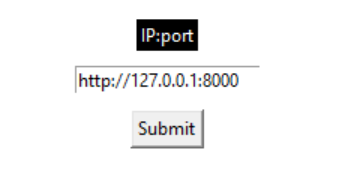

# How to connect FEAGI with Cozmo
## Load Docker:
1. `git clone git@github.com:feagi/feagi.git`
2. `cd ~/feagi/docker`
3. `docker compose -f playground.yml pull`
4. Wait until it's done.
5. `docker compose -f playground.yml up`

## Open Playground Website:
5. Go to [http://127.0.0.1:4000/](http://127.0.0.1:4000/)
6. Click the "GENOME" button on the top right, next to "API."
7. Click "Essential."

## Start Cozmo:
8. Open a new terminal/cmd and run: `git clone https://github.com/feagi/controllers.git`
9. `cd controllers/embodiments/digital_dream_labs/cozmo_1.0`
10. `python3 -m venv venv` (Windows: `python -m venv venv`)
11. `source venv/bin/activate` (Windows: `venv/Scripts/activate`)
12. `pip3 install -r requirements.txt` (Windows: `pip install -r requirements.txt`)
13. `export FEAGI_OPU_PORT=30000` (Windows: `set FEAGI_OPU_PORT=30000`)
14. Connect your Wi-Fi to Cozmo.
15. `python3 controller.py` (Windows: `python controller.py`)
16. Go back to the Playground website and watch it in action!

# Installer of Cozmo for window users (BETA)
1. Download the Cozmo cognitive connector: [here](https://storage.googleapis.com/nrs_embodiments/em-iqgkoadn/controller.zip). 
2. Unzip and click the executable file, `controller.exe`
3. You should see a white dialog screen pop up. 
4. Since you are using Docker, simply click "submit" button under the `IP:port` since it has "https://127.0.0.1:8000" in it.




Note: If you don't want to download anything but prefer to run it from Python source, go to the above section.


# How do I turn Cozmo on and connect it?

1. Place Cozmo on the charger (repeat this step if Cozmo is already on the charger while turned off).
2. Wait until you see the green light on the back.
3. Gently lift Cozmo's arm up and then gently put it down again.
4. The Wi-Fi password will display on Cozmo's screen.
5. Use this password to connect to Wi-Fi.
6. You can now run the controller as described in step #6 above.

# Extra flags
Example command: `python controller.py --help`
```commandline
optional arguments:
  -h, --help            Show this help message and exit.
  
  -magic_link MAGIC_LINK, --magic_link MAGIC_LINK
                        Use a magic link. You can find your magic link from NRS studio.
                        
  -magic-link MAGIC_LINK, --magic-link MAGIC_LINK
                        Use a magic link. You can find your magic link from NRS studio.
                        
  -magic MAGIC, --magic MAGIC
                        Use a magic link. You can find your magic link from NRS studio.
                        
  -ip IP, --ip IP       Specify the FEAGI IP address.
  
  -port PORT, --port PORT
                        Change the ZMQ port. Use 30000 for Docker and 3000 for localhost.

```